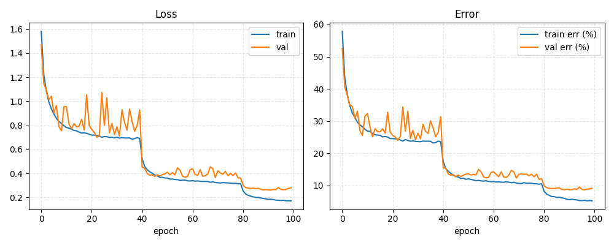
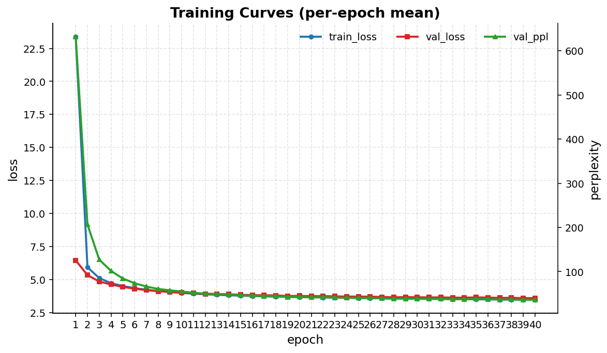
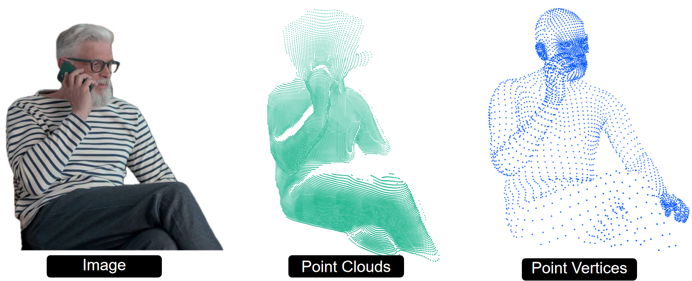

# ESE 5460: Deep Learning

**University of Pennsylvania · Spring 2025**

Homework solutions and a final project for ESE 5460 — Deep Learning.
Topics span classical machine learning through modern generative models and vision transformers.

---

## Homework Index

### [HW1](HW%201/) — Foundations: Feature Engineering & Neural Networks

| Problem | Topic | Implementation |
|---------|-------|---------------|
| P1 | SVM + Gabor filters for MNIST | `sklearn` SVM, hand-crafted texture features |
| P3 | MLP from scratch | NumPy forward/backward pass + PyTorch version |

**P1 — Gabor Filter Bank + SVM**
A bank of Gabor filters (multiple orientations & frequencies) extracts texture features from 28×28 MNIST digits.
The feature vectors are fed into an SVM (RBF kernel, tuned via grid search), achieving strong classification accuracy without any learned representations.

**P3 — Neural Network on MNIST**
A fully-connected network trained end-to-end on MNIST, implemented twice: once in raw NumPy (manual backprop) and once in PyTorch, to build intuition for autodiff.

---

### [HW2](HW2/) — CNNs, RNNs & Data Augmentation

| Problem | Topic | Implementation |
|---------|-------|---------------|
| P3 | Data augmentation | Brightness, contrast, rotation, shear, solarize … |
| P3 | ResNet-18 from scratch | Residual blocks, skip connections in PyTorch |
| P4 | RNN character-level LM | Text generation on Shakespeare / War and Peace |
| — | Adversarial examples | FGSM gradient attack on a CNN |

**ResNet-18** — full reimplementation with residual blocks and parameter count analysis.

**RNN language model** — character-level model trained on classic literature, generating new text autoregressively.

**Adversarial examples** — FGSM attack: a small gradient-based perturbation (invisible to humans) flips CNN predictions.

<p align="center">
  
  <br><em>CNN predictions before and after adversarial perturbation</em>
</p>

---

### [HW3](HW3/) — Optimisation, MLP & Transformer

| Problem | Topic | Implementation |
|---------|-------|---------------|
| Logistic Regression | GD / SGD / Nesterov momentum | Convergence comparison |
| MLP | Regression with BatchNorm | 2- and 3-layer MLP in PyTorch |
| Transformer | Character-level language model | Built from scratch in PyTorch |

**Optimisation** — compares gradient descent, SGD, and Nesterov accelerated gradient on logistic regression.

**Transformer from scratch** — sinusoidal positional encoding, multi-head causal self-attention, residual + LayerNorm blocks, byte-level tokeniser.

<p align="center">
  
  <br><em>Transformer training &amp; validation loss / perplexity over 100 epochs</em>
</p>

---

### [HW4](HW%204/) — Variational Autoencoder (VAE)

**Task:** Learn a generative model of MNIST digits with a continuous latent space.

**Architecture:** Encoder → (μ, log σ²) → reparameterisation → Decoder (Bernoulli likelihood, latent dim = 8).

**ELBO loss:**

$$\mathcal{L} = \underbrace{-\mathbb{E}_{q_\phi}[\log p_\theta(x|z)]}_{\text{reconstruction}} + \underbrace{D_\text{KL}(q_\phi(z|x) \| p(z))}_{\text{regularisation}}$$

Monte Carlo estimation with multiple samples per step; importance-weighted log-likelihood for evaluation.

| File | Description |
|------|-------------|
| [`vae_model.py`](HW%204/vae_model.py) | Encoder & Decoder |
| [`train.py`](HW%204/train.py) | Training loop with ELBO |
| [`inference_reconstruct.py`](HW%204/inference_reconstruct.py) | Reconstruction & sampling |
| [`validation_loglikelyhood.py`](HW%204/validation_loglikelyhood.py) | Importance-weighted log-likelihood |

---

## Final Project — Human3R: Online Human-Scene Reconstruction

**Task:** Real-time 3-D reconstruction of humans and scenes from monocular video, combining human body estimation (SMPL-X) with dense scene geometry.

**Method:** Extends [CUT3R](https://github.com/CUT3R/CUT3R) / DUSt3R with online inference and SMPL-X sequence integration. The `ARCroco3DStereo` model predicts dense stereo point maps; SMPL-X body meshes are aligned to the reconstructed scene and rendered with `SceneHumanViewer`.

<p align="center">
  
  <br><em>Human and scene reconstruction from monocular video</em>
</p>

**Reference papers in [`PROJ/`](PROJ/):**
- Ranftl et al. — *Vision Transformers for Dense Prediction* (ICCV 2021)
- DUSt3R / CUT3R dense reconstruction papers

---

## Repository Structure

```
Deep_Learning/
├── HW 1/      Gabor SVM · NumPy MLP · MNIST
├── HW2/       ResNet · RNN · data augmentation · adversarial examples
├── HW3/       Optimisers · MLP · Transformer LM
├── HW 4/      Variational Autoencoder
├── PROJ/      Final project — Human3R
└── LEC/       Lecture slides 01–16
```

---

## Dependencies

```
torch  torchvision  numpy  matplotlib  scikit-learn  opencv-python
```
